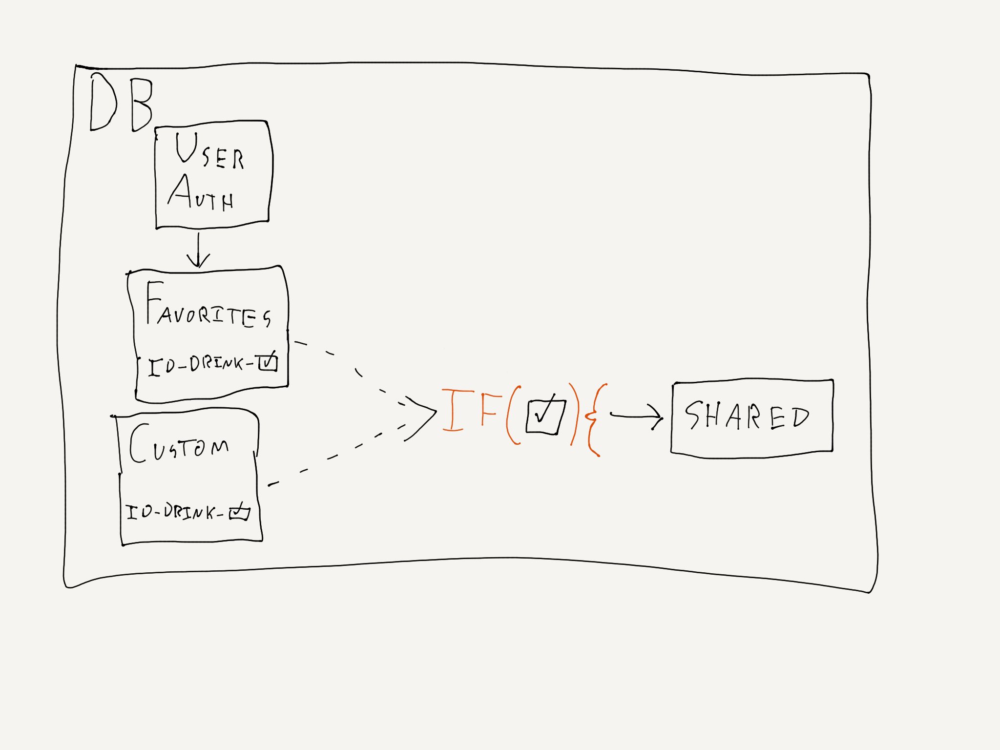
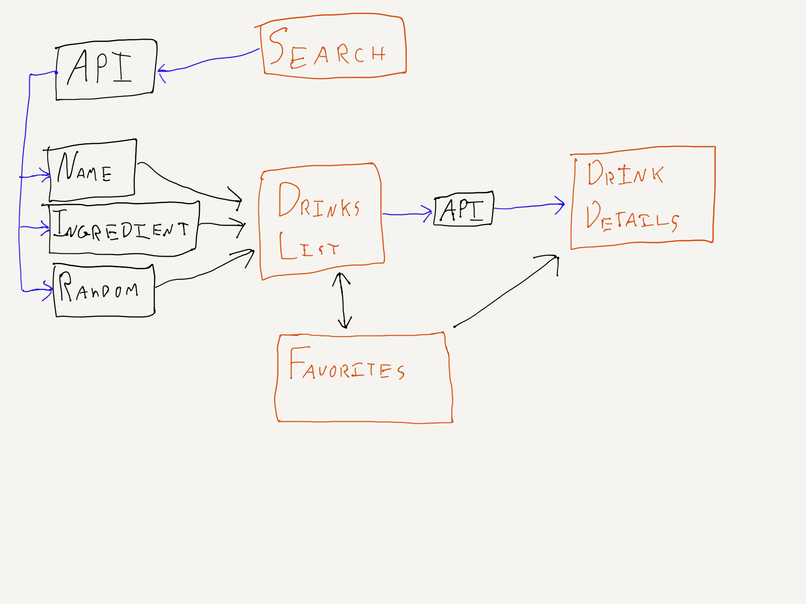
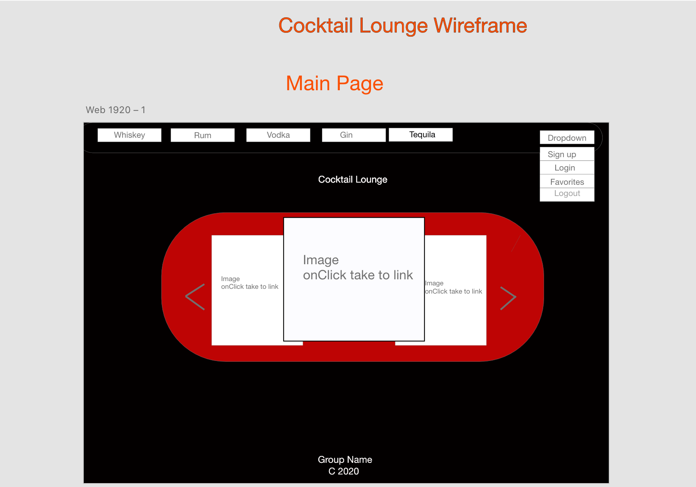
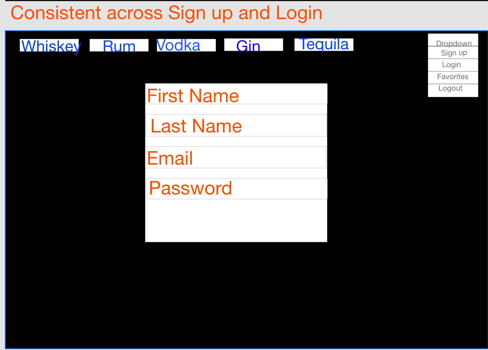
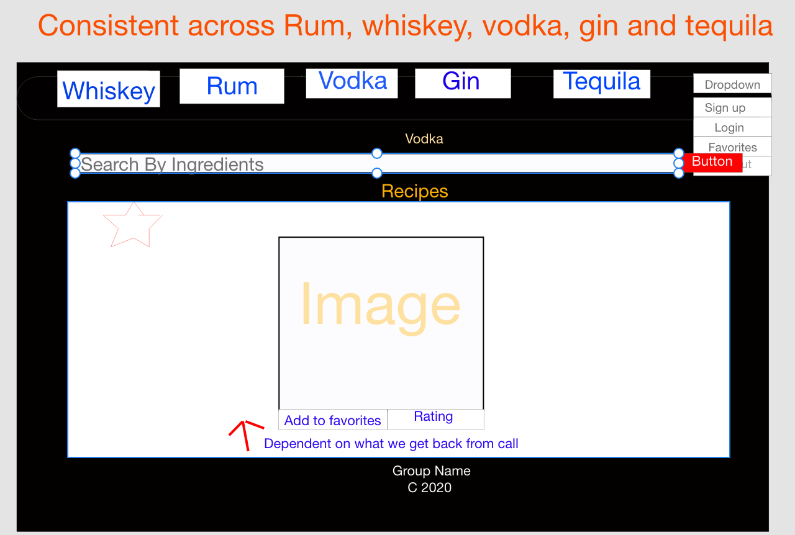
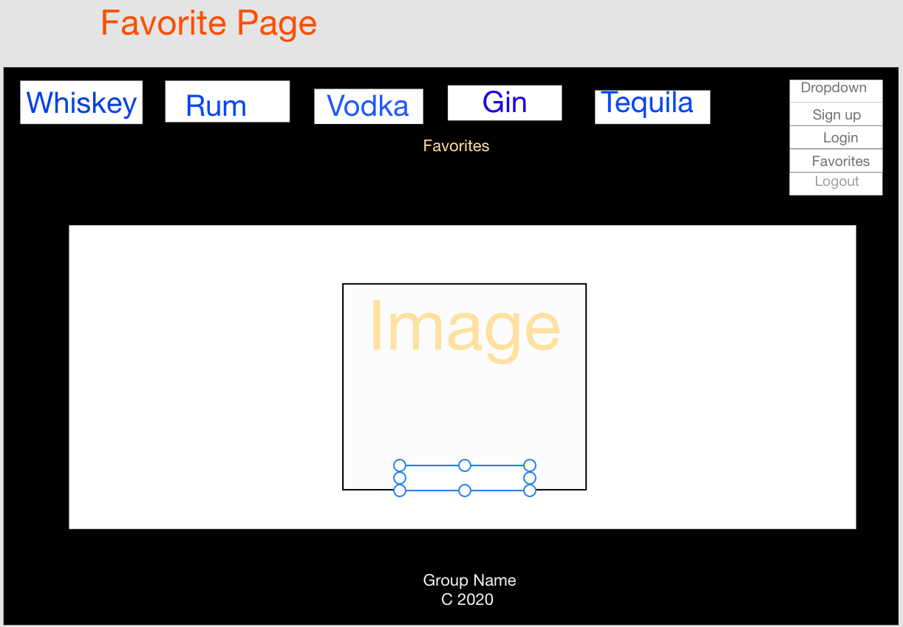

# The Cocktail Lounge

## Description

Search for cocktail recipes by name, liquor type, or other ingredients. Sign up for a “premium” account to save your favorites, and even create your own recipes and share them with other users. As a premium user you can also rate others’ shared recipes (1-5 stars).

## Elevator Pitch

With the current state of the world, people are spending more time than ever in their own homes. For many of us (especially those of us with high-energy children), all that extra time cooped up inside often means increased stress, anxiety, and/or just plain boredom. Whatever of these symptoms you might be experiencing, we know of one solution to aid with them all - alcohol! We would love to welcome you to The Cocktail Lounge - your online solution for finding the tastiest and/or “most efficient” way to take the edge off… or just make your forget that you’re stuck at home altogether.
Easily find recipes by name, or even just filter them out by ingredient if you know what you’ve got in your house, but aren’t so sure what you can make out of it. Feeling adventurous? We’ve got a “Just \*\*\*\* Me Up Fam” button that will find you a random recipe. The possibilities are only limited by what you’ve got in your liquor cabinet.
“Premium” users also unlock the ability to save & share their favorite recipes with other members of The Cocktail Lounge - you can even create and share your favorite “experiments” that we’re sure you’ve been fiddling with since this whole “stay at home” business started. Compete with your friends to see who can get the most 5-Star ratings on their custom cocktails - endless fun and creativity await!

## User Story

`AS A alcoholic beverage enthusiast`

`I WANT to be able to access cocktail recipes`

`SO THAT I can make them at home, save my favorites, share my new ideas with others, and try new things.`

`GIVEN a search bar`

`WHEN I search for a drink or ingredient`

`THEN I am presented with a list of cocktails that meet the search parameters`

`WHEN I click on a specific drink`

`THEN I am shown the recipe and instructions for making the drink`

`IF I choose to sign up for a “Premium” account`

`THEN I am presented with a Signup form`

`WHEN I log in / sign up`

`THEN I am able to save recipes to my “Favorites”`

`AND create my own recipes to share with other users`

`WHEN I view the “Shared” recipes, I am able to give them a rating out of 5 Stars`

# Technologies Used:
* React
* React-bootstrap
* MongoDB (database)
* Express (server)
* React router (navigate between pages).
* CocktailDB API
* Lodash

# Wireframes

### Backend:

### Frontend:

 

